# ComputerVisionExercise

In this repository I will be contributing all the necessary tools in OpenCV and its application with better code explanation. Every operations are explain well below with their examples.

## Bitwise operation
Bitwise operation is similar to logic gate we have studied during our high school. This operation contains AND, OR, NOT, XOR operators that deals with same mathematical solution for images.

<b>1. bitwiseAND</b>  
Bitwise AND maps the common pixels present in overlapping images.  
 

<b>2. bitwiseOR </b>  
Bitwise OR maps all images overlapping and non overlapping conditions. 

<b>3. bitwiseNOT</b>  
Bitwise NOT maps overlapping condition and inverse it with non overlapping conditions.  

<b>4. bitwiseXOR</b>  
Bitwise XOR maps exclusive overlapping conditions.  

## Blurring Techniques
<b>1. averageBlur</b>  
The image is convolved with a box filter (normalized). In this process, the central element of the image is replaced by the average of all the pixels in the kernel area.  

<b>2. bilateralBlur</b>  
Bilaretal bluring is also known as image smoothing, image blurring is achieved by convolving the image with a low-pass filter kernel. It is useful for removing noise. It actually removes high frequency content (eg: noise, edges) from the image.  

<b>3. gaussianBlur</b>  
In Gaussian Blur operation, the image is convolved with a Gaussian filter instead of the box filter. The Gaussian filter is a low-pass filter that removes the high-frequency components are reduced.  

<b>4. medianBlur</b>  
Here, the central element of the image is replaced by the median of all the pixels in the kernel area. This operation processes the edges while removing the noise.  

## Color Channels
This folder contains channeling of the images that combines all the basic colors that is red blue and green.
<b>1. splitting and merging colors</b>  
Since images in OpenCV are internally represented as NumPy arrays, accessing each channel can be accomplished in multiple ways, implying multiple ways to skin this images.  
a. Splitting red color  
  
b. Splitting blue color  
  
c. Splitting green color  
 

## Color Spaces
This folder contains most used image color spaces such as hue, gray, labs and blur.

<b>1. LAB</b> 
It expresses color as three values: L* for perceptual lightness, and a* and b* for the four unique colors of human vision: red, green, blue, and yellow. CIELAB was intended as a perceptually uniform space, where a given numerical change corresponds to a similar perceived change in color.  

<b>2. Grayscale</b> 
The grayscale image of the same size as a color image, made of just one of these primary colors. For instance, an image from a standard digital camera will have a red, green and blue channel. A grayscale image has just one channel.  
 

<b>3. Hues</b>  
Hue refers to the dominant color family. Hue refers to the origin of the colors we can see. Primary and Secondary colors (Yellow, Orange, Red, Violet, Blue, and Green) are considered hues. 

<b>4. LABtoBGR</b> 
Conversion of image with channel LAB to BGR.  
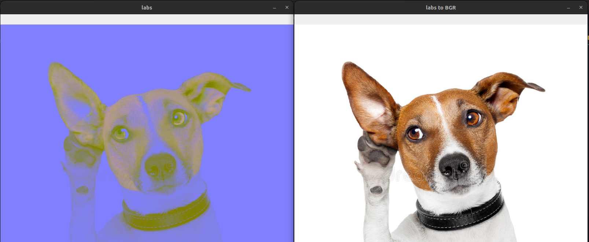

<b>5. bgrtorgb</b>  
Conversion of image with channel BGR to RGB.  
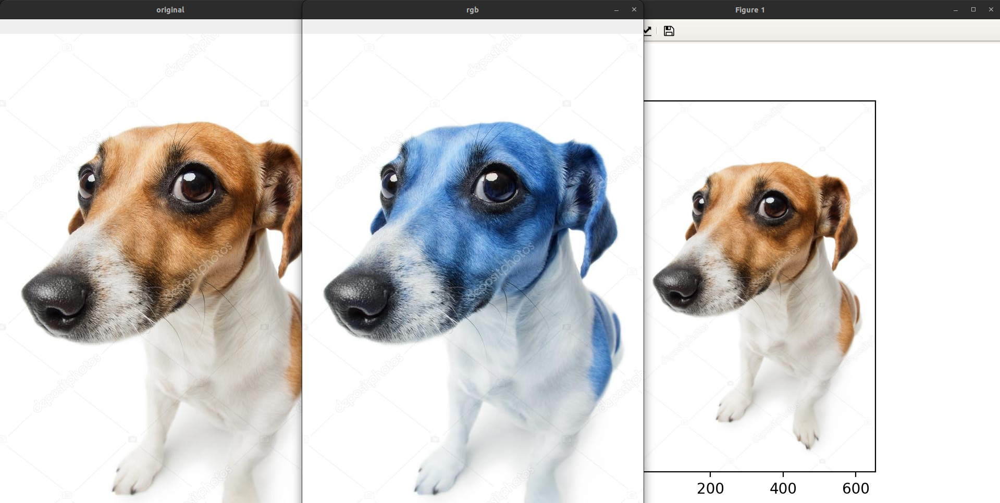

<b>6. hsvtobgr</b>  
Conversion of images with channel HSV to BGR. 
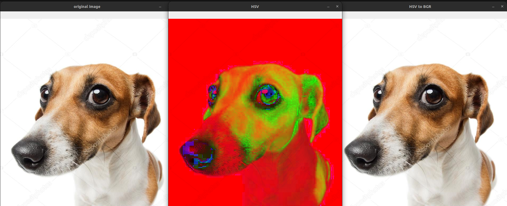

## Computing Histogram
Histogram from matplotlib can clearly classify which color channel the image adapt. This program creates a frequency of all the color channel used in the image.

<b>1. Colorhistogram</b>  
Frequency of all the color present in the colored images.  
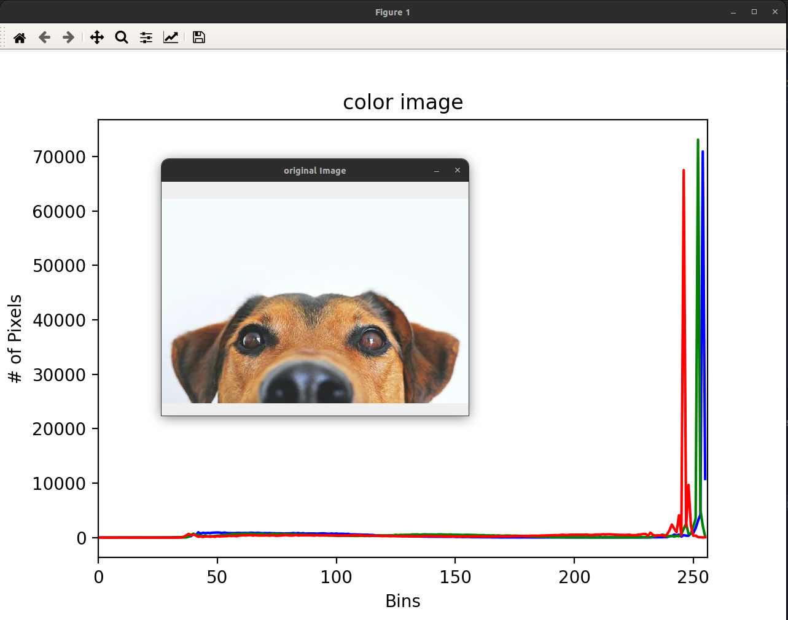

<b>2. Grayhistogram</b>  
Frequency of the channel grayscale images. 
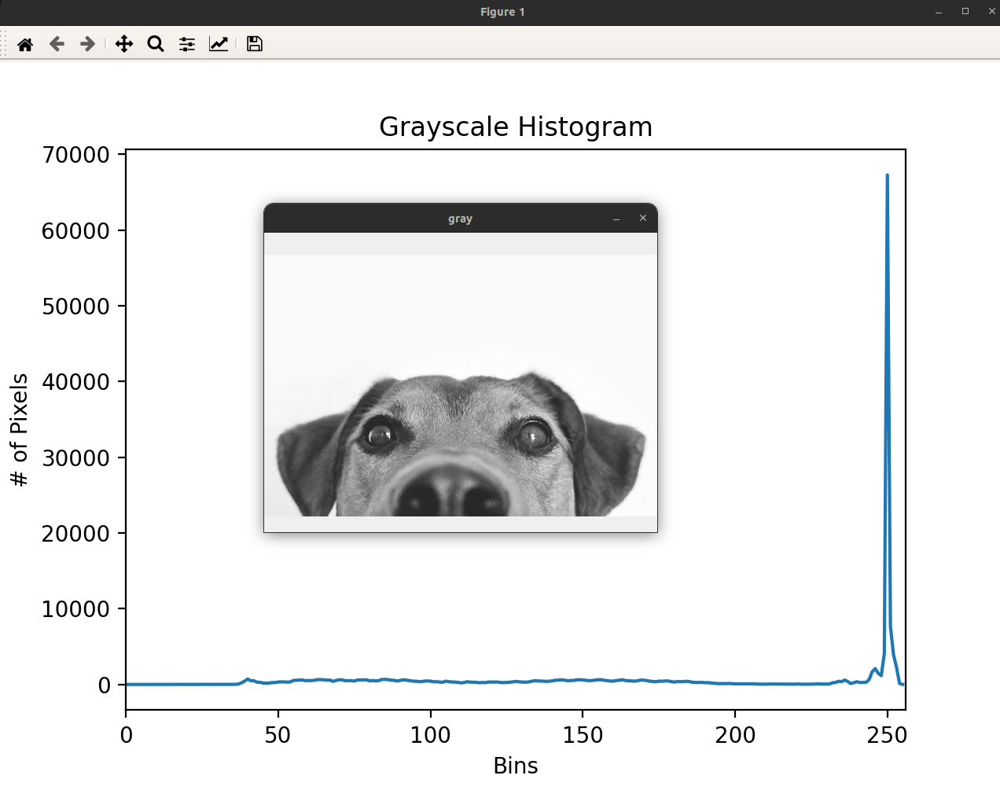

<b>3. Histogram masking</b> 
This checks colors frequency of masked area. 
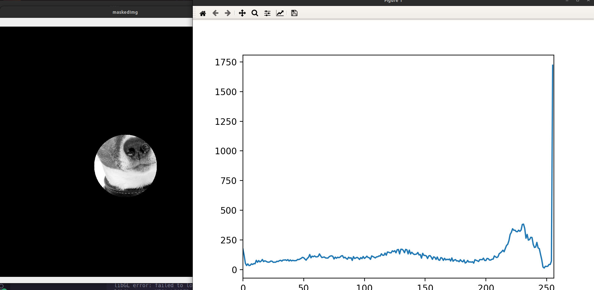

## Gradients and edges
Every pixel inside the Gradient image represents the contrast intensity in the neighborhood of a pixel. It is used for image segmentation and edge detection. 
Edge detection is an image-processing technique, which is used to identify the boundaries (edges) of objects, or regions within an image. Edges are among the most important features associated with images.  

<b>1. AbsoluteLaplation</b>  
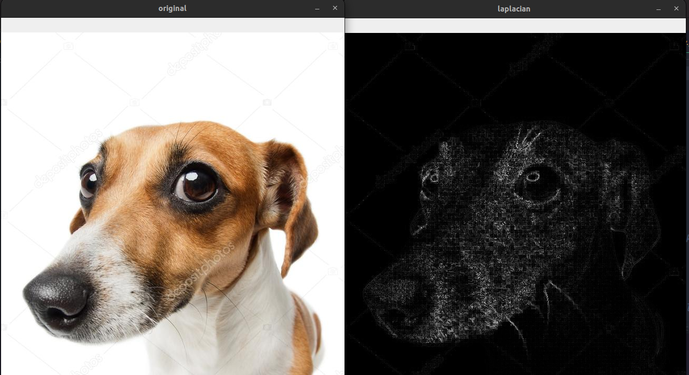

<b>2. Laplacian</b>  
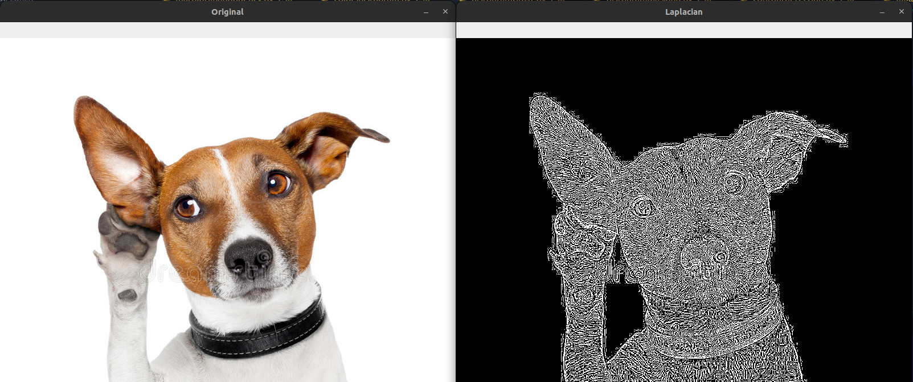

<b>3. Sobel </b>  
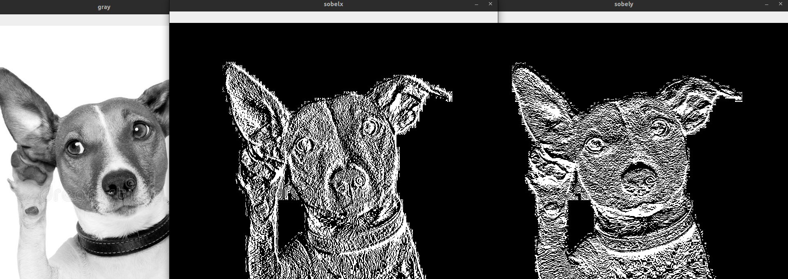

## Image Transformations
This folder contains all the image transformations related functions and libraries in OpenCV.

<b>1. Image Flipping. </b>  
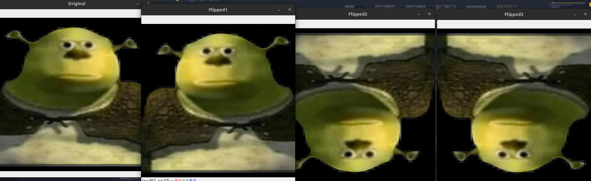 
<b>2. Image Rotation.</b>  
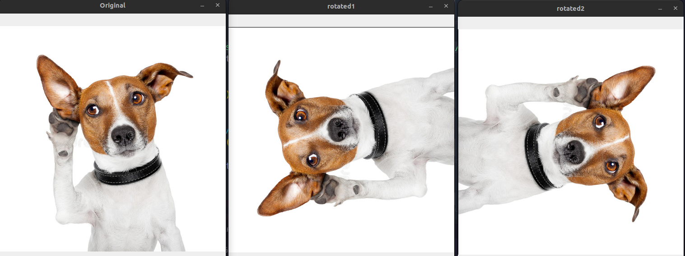 
<b>3. Shifting Images.</b>  
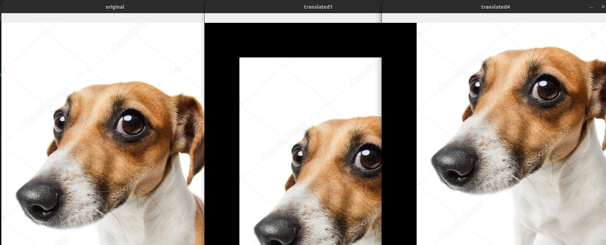 

## Important color scaling
It contains all the scaling features of openCV.

<b>1. Canny. </b> 
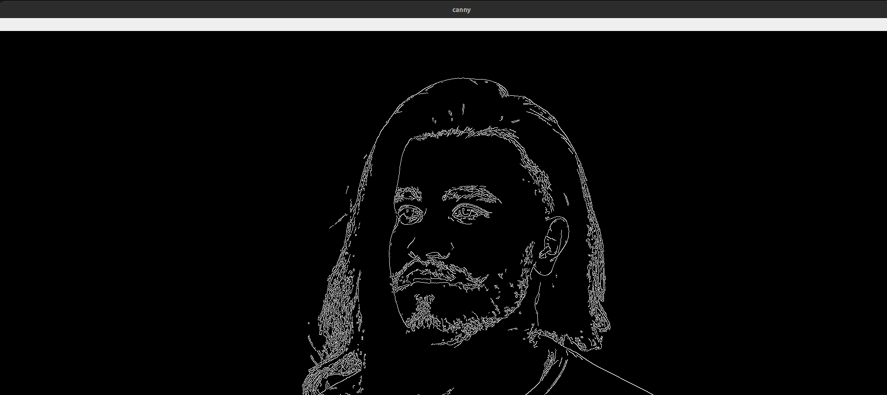 
<b>2. Gaussian Blur.</b>  
 
<b>3. GrayScale.</b> 
 

## Masking
Masking is something we consider as focusing in some areas of image. Lets have a look into some of the methods that are carried out for masking.  
<b> circleMasking </b> 
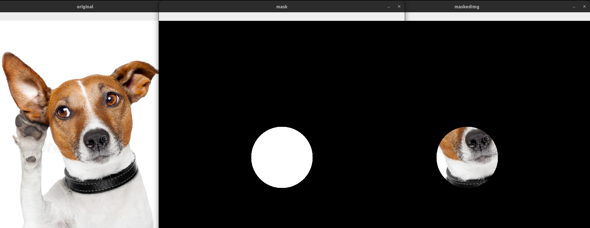 

<b>2. rectangleMasking</b> 
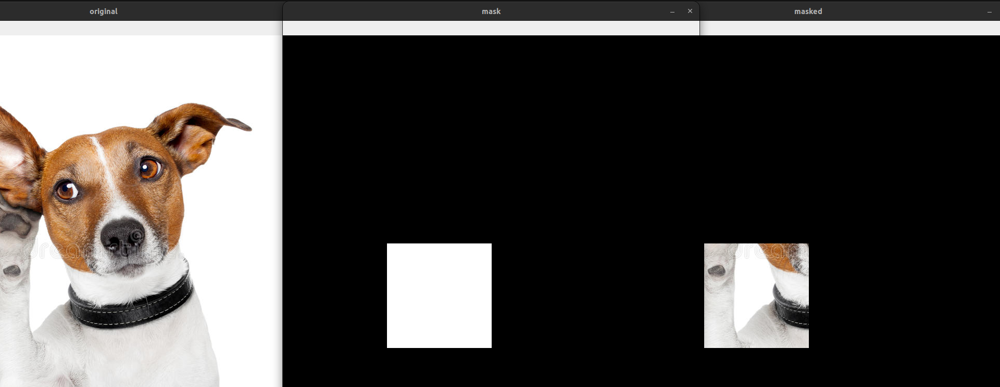 

<b>3. weirdshapes</b>  
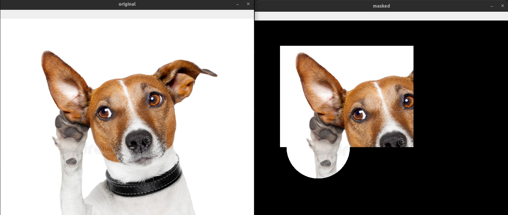 

## Some reallife implementations
This folder contains all the real life implementation that I have done using OpenCV.

1. motion detection.

## Basic reading and rescaling
This folder contains all the basic reading and rescaling technique in OpenCV.

1. cv2 reading image.
2. cv2 reading videos.
3. cv2 resize and rescale.
4. cv2 resizing.
5. cv2 webcam.

## Draw and write on images.
This folder contains drawing in a blank canvas or creating a bounding box in the detected place.

1. Draw.

## Resources
This folder contains images and video used for all the programs.

1. Images.
2. Videos.

These are some of the fundamentals of this repository.
Hope it helps somebody who is exploring OpenCV and ended up here.

## Thresholding
<b>1. AdaptiveThresholding </b>  
Adaptive thresholding is the method where the threshold value is calculated for smaller regions and therefore, there will be different threshold values for different regions.  
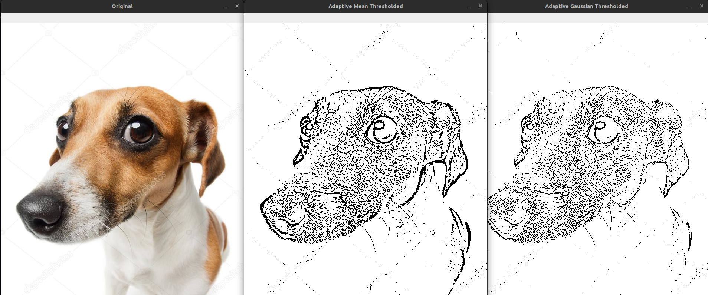 

<b>2. InverseThresholding</b>  
Inverse-Binary Thresholding is just the opposite of Binary Thresholding. The destination pixel is set to: zero, if the corresponding source pixel is greater than the threshold.  
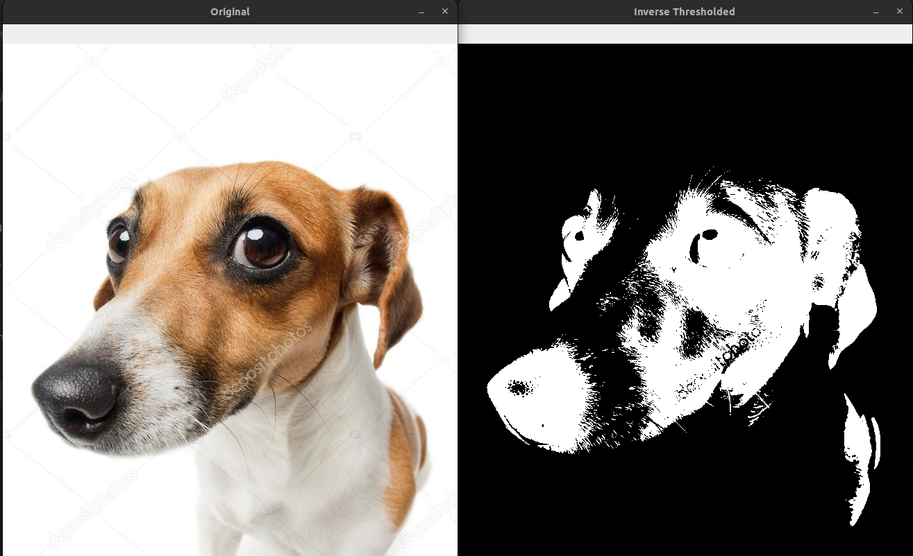 

<b>3. SimpleThresholding </b>  
Simple thresholding where we manually supply parameters to segment the image — this works extremely well in controlled lighting conditions where we can ensure high contrast between the foreground and background of the image.  
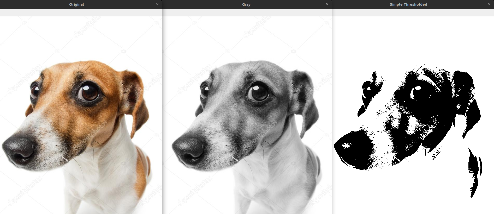 

## happy coding.
