# ComputerVisionExercise

In this repository I will be contributing all the necessary tools in OpenCV and its application with better code explanation. Every operations are explain well below with their examples.

## Bitwise operation
Bitwise operation is similar to logic gate we have studied during our high school. This operation contains AND, OR, NOT, XOR operators that deals with same mathematical solution for images.

1. bitwiseAND  
Bitwise AND maps the common pixels present in overlapping images.
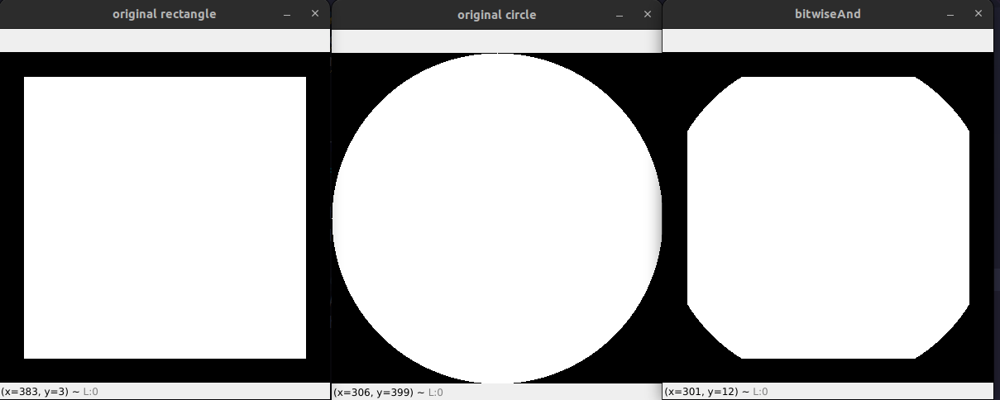 

2. bitwiseOR  
Bitwise OR maps all images overlapping and non overlapping conditions.
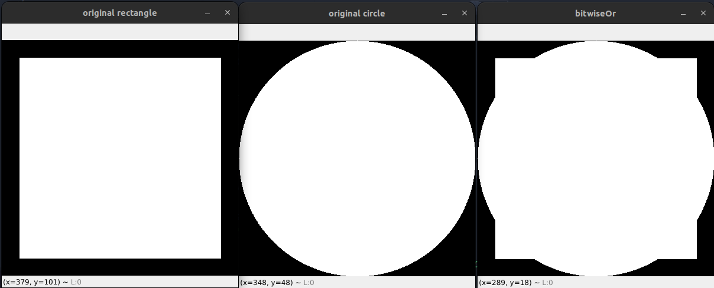

3. bitwiseNOT  
Bitwise NOT maps overlapping condition and inverse it with non overlapping conditions.
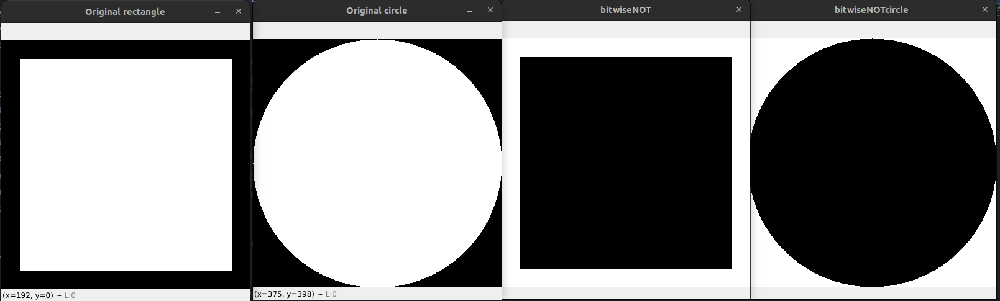

4. bitwiseXOR  
Bitwise XOR maps exclusive overlapping conditions.
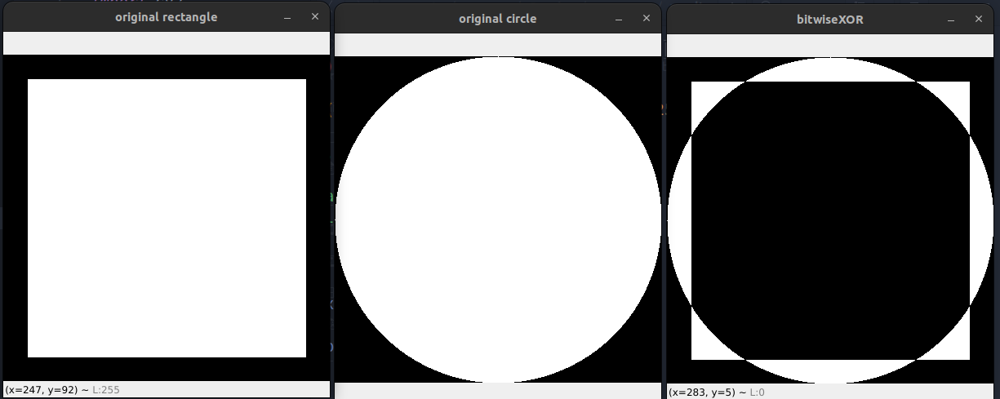

## Blurring Techniques
1. averageBlur  
The image is convolved with a box filter (normalized). In this process, the central element of the image is replaced by the average of all the pixels in the kernel area.
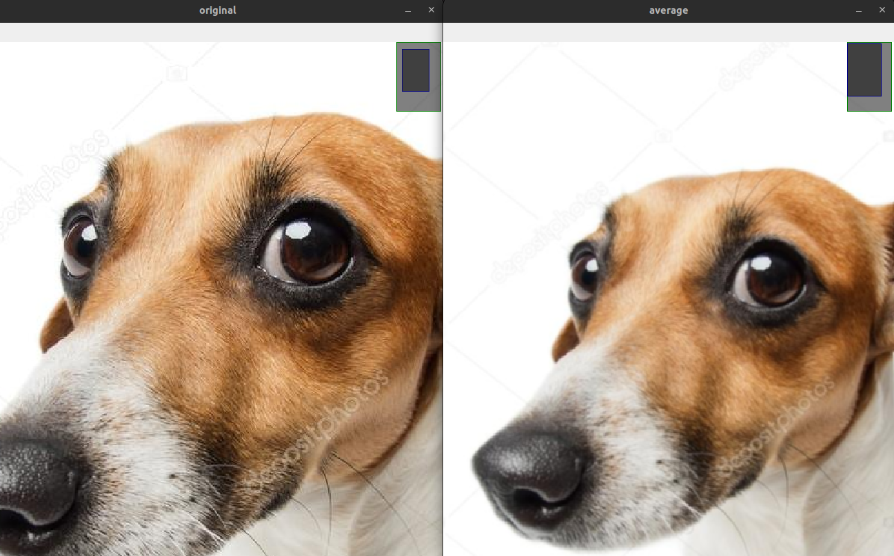

2. bilateralBlur  
Bilaretal bluring is also known as image smoothing, image blurring is achieved by convolving the image with a low-pass filter kernel. It is useful for removing noise. It actually removes high frequency content (eg: noise, edges) from the image.
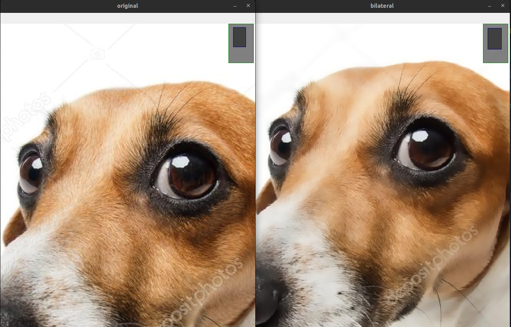

3. gaussianBlur  
In Gaussian Blur operation, the image is convolved with a Gaussian filter instead of the box filter. The Gaussian filter is a low-pass filter that removes the high-frequency components are reduced.

4. medianBlur  
Here, the central element of the image is replaced by the median of all the pixels in the kernel area. This operation processes the edges while removing the noise.
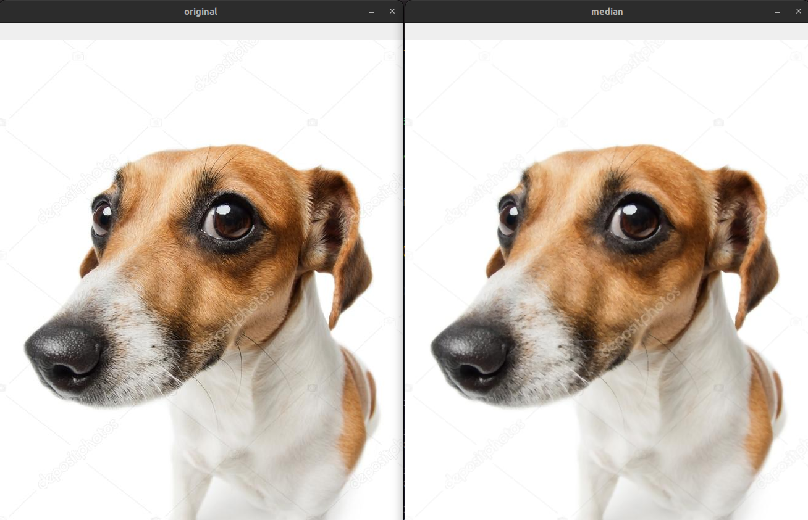

## Color Channels
This folder contains channeling of the images that combines all the basic colors that is red blue and green.
1. splitting and merging colors  
Since images in OpenCV are internally represented as NumPy arrays, accessing each channel can be accomplished in multiple ways, implying multiple ways to skin this images.
 
a. Splitting red color
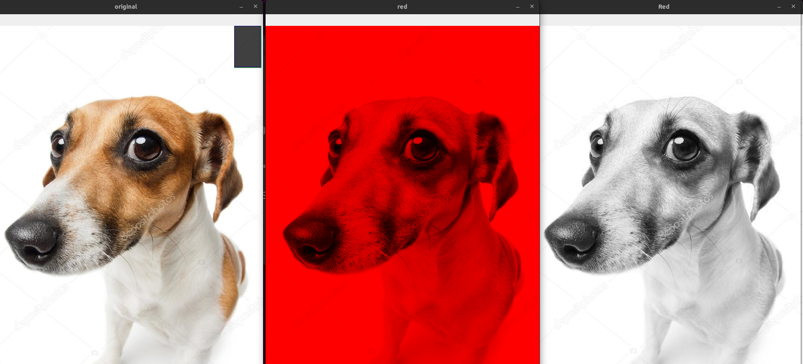
b. Splitting blue color
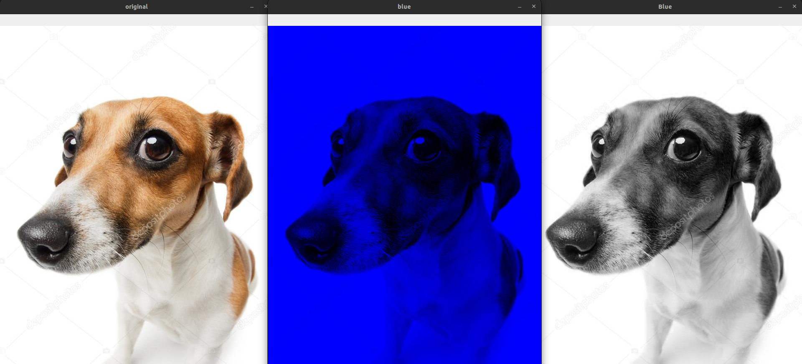
c. Splitting green color
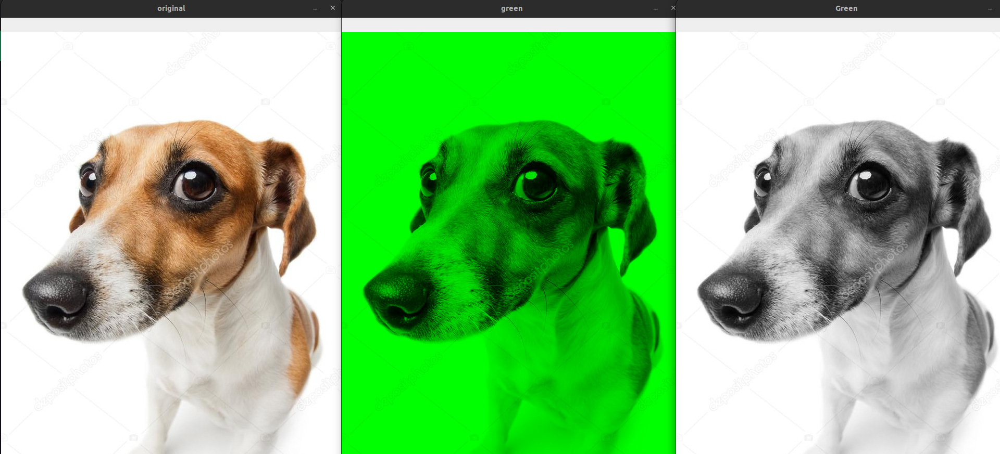

## Color Spaces
This folder contains most used image color spaces such as hue, gray, labs and blur.

1. LAB 
It expresses color as three values: L* for perceptual lightness, and a* and b* for the four unique colors of human vision: red, green, blue, and yellow. CIELAB was intended as a perceptually uniform space, where a given numerical change corresponds to a similar perceived change in color.

2. Grayscale 
The grayscale image of the same size as a color image, made of just one of these primary colors. For instance, an image from a standard digital camera will have a red, green and blue channel. A grayscale image has just one channel.
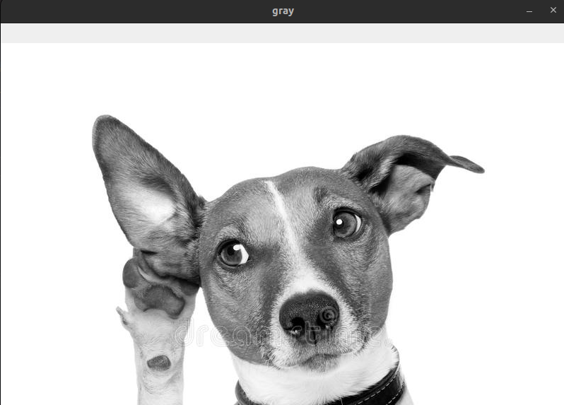 

3. Hues  
Hue refers to the dominant color family. Hue refers to the origin of the colors we can see. Primary and Secondary colors (Yellow, Orange, Red, Violet, Blue, and Green) are considered hues.
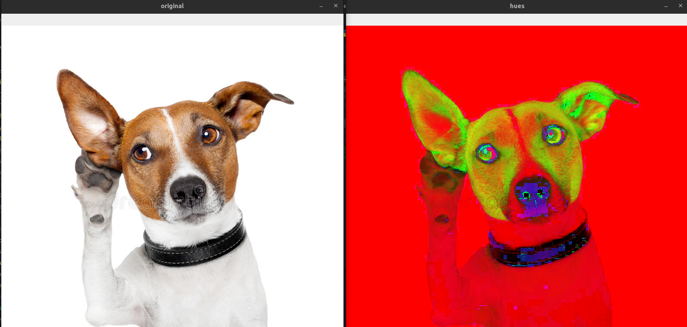

## Image Transformations
This folder contains all the image transformations related functions and libraries in OpenCV.

1. Image Flipping.
2. Image Rotation.
3. Shifting Images.

## Important color scaling
It contains all the scaling features of openCV.

1. Canny.
2. Gaussian Blur.
3. GrayScale.

## Some reallife implementations
This folder contains all the real life implementation that I have done using OpenCV.

1. motion detection.

## Basic reading and rescaling
This folder contains all the basic reading and rescaling technique in OpenCV.

1. cv2 reading image.
2. cv2 reading videos.
3. cv2 resize and rescale.
4. cv2 resizing.
5. cv2 webcam.

## Draw and write on images.
This folder contains drawing in a blank canvas or creating a bounding box in the detected place.

1. Draw.

## Resources
This folder contains images and video used for all the programs.

1. Images.
2. Videos.

These are some of the fundamentals of this repository.
Hope it helps somebody who is exploring OpenCV and ended up here.

## happy coding.
